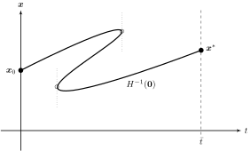
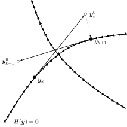
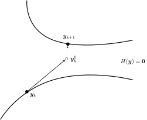

How the solver works
====================

For any stochastic games, the necessary and sufficient conditions
for stationary equilibrium can be expressed as a
(potentially high-dimensional and nonlinear) system of equations.
sGameSolver relies on a solution method called
:ref:`homotopy continuation <Homotopy continuation>` for such systems.
Numerically, homotopy continuation is performed by a
:ref:`predictor-corrector procedure <Predictor-corrector procedure>`.

Homotopy continuation
---------------------

Homotopy continuation denotes a class of numerical techniques to solve
high-dimensional nonlinear systems of equations.
The basic idea is the following.
Given a complicated problem to solve,
first take a similar but simple problem and solve it.
Then, gradually transform the simple problem into the complicated problem
while holding on to the solution along the way.
For excellent textbook treatments of homotopy methods see
Zangwill and Garcia (1981) and Allgower and Georg (1990).

Compared to most other numerical methods,
homotopy continuation methods have the major advantage of working globally.
Iterative Newton methods, for example, are only locally convergent,
meaning they require a good initial approximation to produce a solution at all.
In contrast, homotopy methods arrive at solutions without such
a priori knowledge, rendering them an exceptionally powerful tool.

The method generally proceeds in two steps:
First the formulation of a suitable homotopy function,
which implicitly defines a curve from a starting point to the desired solution;
and then the numerical traversal along this curve
until the solution is obtained.
Intuitively, this resembles "bending" the problem until an easy solution
is readily available, then reverting it back to the original form,
while holding on to the solution.

Mathematical formulation
""""""""""""""""""""""""

More concretely, suppose one wants to find a solution
:math:`\boldsymbol{x}^{*}` to :math:`F(\boldsymbol{x}) = \boldsymbol{0}`,
where :math:`F: \mathbb{R}^n \rightarrow \mathbb{R}^n` is
a vector-valued mapping.
One constructs a function :math:`G: \mathbb{R}^n \rightarrow \mathbb{R}^n`
of the same dimensionality such that a solution
:math:`\boldsymbol{x}_0 \in G^{-1}(\boldsymbol{0})` is known
or trivially obtained.
Then, a homotopy parameter :math:`t \in [0, \bar{t}]`
with :math:`\bar{t} \in (0, \infty]` is introduced.
(The case :math:`\bar{t} = \infty` is explicitly included.)
The homotopy parameter is used to construct a
homotopy function :math:`H(\boldsymbol{x},t)`,
with :math:`H: \mathbb{R}^{n+1} \rightarrow \mathbb{R}^n`,
satisfying :math:`H(\boldsymbol{x},0) = G(\boldsymbol{x})`
and :math:`H(\boldsymbol{x},\bar{t}) = F(\boldsymbol{x})`.
If :math:`H` is constructed properly, it thus offers a
continuous transformation of the original hard problem
:math:`F(\boldsymbol{x}) = \boldsymbol{0}` into a trivial one
:math:`G(\boldsymbol{x}) = \boldsymbol{0}` and vice versa.
The set of solutions :math:`H^{-1}(\boldsymbol{0}) =
\{ (\boldsymbol{x},t) \mid H(\boldsymbol{x},t) = \boldsymbol{0} \}`
then contains a curve connecting the known solution
:math:`(\boldsymbol{x}_0, 0)` to the desired solution
:math:`(\boldsymbol{x}^{*}, \bar{t})`.

Homotopy function and Jacobian matrix
"""""""""""""""""""""""""""""""""""""

The system of equation in question can be written as

.. math:: H(\boldsymbol{x}, t) = \boldsymbol{0}

where :math:`(\boldsymbol{x}, t) \in \mathbb{R}^{n+1}`
and :math:`H: \mathbb{R}^{n+1} \rightarrow \mathbb{R}^n` is a
vector-valued homotopy function.
The corresponding Jacobian matrix
:math:`J: \mathbb{R}^{n+1} \rightarrow \mathbb{R}^n \times \mathbb{R}^{n+1}`
is defined by

.. math:: J(\boldsymbol{x}, t) = \frac{\partial H(\boldsymbol{x}, t)}{\partial (\boldsymbol{x}, t)}

Parameterization
""""""""""""""""

The homotopy path might have turning points in the sense that the
homotopy parameter :math:`t` is not monotonically increasing along the path,
as illustrated in :numref:`turnings`.

.. _turnings:

    Turning points along the homotopy path.

Therefore, it is generally not possible to follow the path by
naively increasing :math:`t`.
Instead it is convenient to parameterize the homotopy function in terms of
the path length parameter :math:`\tau \in \mathbb{R}_0^+` such that
:math:`H(\boldsymbol{x}(\tau), t(\tau)) = \boldsymbol{0}`. Then,

.. math:: \frac{\partial (\boldsymbol{x}, t)_k}{\partial \tau} \;=\; \eta \: (-1)^k \: \det(J^{(-k)}(\boldsymbol{x}, t))

for :math:`k \in \{1, ..., n\!+\!1\}`,
where :math:`J^{(-k)}(\boldsymbol{x}, t)` denotes the Jacobian matrix
without its :math:`k`-th column and
:math:`\eta \in \mathbb{R}^+` is a normalization factor.
For details, see Zangwill and Garcia (1981, pp. 25 ff.).

Principal branch
""""""""""""""""

In general, the homotopy path :math:`H^{-1}(\boldsymbol{0})` is not guaranteed
to be as well-behaved as suggested by the previous picture.
It might feature multidimensional segments, bifurcations, dead ends or spirals.
For path tracking to be well-defined,
the homotopy path :math:`H^{-1}(\boldsymbol{0})` must include a
smooth branch :math:`\mathcal{H}^0`
through :math:`(\boldsymbol{x}_0, 0)`
that is almost everywhere one-dimensional,
with only isolated transversals of auxiliary path segments.
A corresponding illustration is provided in :numref:`infeasible`
and :numref:`feasible`.

.. _infeasible:
.. figure:: img/tikz-figure1.svg
    :width: 300
    :alt: tracing infeasible
    :align: left

    Path tracing infeasible.

.. _feasible:
.. figure:: img/tikz-figure2.svg
    :width: 320
    :alt: tracing feasible

    Path tracing feasible.

All homotopies implemented in sGameSolver are guaranteed to feature a
well-defined principal branch for every possible game.
Tracing this path to arrive at the desired equilibrium
is done numerically by predictor-corrector iterations.

Predictor-corrector procedure
-----------------------------

Predictor-corrector procedures are the standard tool to trace differentiable
homotopy paths. As the name suggests, these are two-phase procedures,
sequentially performing a prediction step and multiple correction steps.
In the predictor step, the path at the current point
:math:`\boldsymbol{y}_k := (\boldsymbol{x}, t)_k`
is extrapolated along its tangent with step size :math:`ds`.
Afterwards, the predictor point :math:`\boldsymbol{y}_k^0` is refined
by a number of Newton corrector steps.
Corrector steps are performed orthogonally to current tangents
until a new point :math:`\boldsymbol{y}_{k+1}` on the path is reached.
Then, the step size is adapted and the two-step procedure is repeated,
as illustrated in :numref:`predictorcorrector`.

.. _predictorcorrector:
.. figure:: img/tikz-figure3.svg
    :width: 600
    :alt: predictor-corrector procedure
    :align: center

    Predictor-corrector procedure.

Direction
"""""""""

The homotopy path implied by :math:`H(\boldsymbol{y}) = \boldsymbol{0}`
is defined up to its direction :math:`\alpha \in \{1, -1\}`.
In order to obtain the correct direction for path traversal,
:math:`\alpha` is chosen such that the very first predictor step
increases :math:`t` and is held constant thereafter,
except in the case of crossing a bifurcation point.

Bifurcation detection
"""""""""""""""""""""

The principal branch of the homotopy path might be crossed
by another branch at some point, as illustrated in :numref:`bifurcation`.

.. _bifurcation:

    A simple bifurcation.

These so-called simple bifurcations are singular points of the Jacobian matrix
at which the direction of the path may be reversed
(see Allgower and Georg, 1990, chapter 8).

In order to ensure continuation after the bifurcation,
simple bifurcation points must be detected and,
in case of a reversal of direction,
the sign of the direction :math:`\alpha` must be swapped.
To detect bifurcations, the angle between consecutive predictor tangents
is checked at each step.
If the angle is close to 180° and the tangents point in almost
opposite directions, the algorithm considers a bifurcation point
with reversal of the direction crossed.
Specifically, the sign of :math:`\alpha` is swapped if

.. math:: [p(\boldsymbol{y}_k)]^T \: p(\boldsymbol{y}_{k-1}) \;<\; \cos(\gamma_{\min})]

with tangent :math:`p(\boldsymbol{y})` and minimum angle :math:`\gamma_{\min}`
to classify changes in direction as bifurcation.

Predictor tangent
"""""""""""""""""

At each point :math:`\boldsymbol{y}_k`, the predictor tangent is computed
based on a complete QR decomposition
of the transpose :math:`[J(\boldsymbol{y}_k)]^T`
of the Jacobian at point :math:`\boldsymbol{y}_k`.
After successful QR decomposition, the tangent is essentially given by
the last column of matrix :math:`Q`,
adjusted for the sign of the determinant of matrix :math:`R`.
Specifically, tangent :math:`p(\boldsymbol{y}_k)` is computed as

.. math:: p(\boldsymbol{y}_k) \;=\; \alpha \: \text{sign}(\det(R)) \: Q^{(n+1)}

Given step size :math:`ds` and tangent :math:`p(\boldsymbol{y}_k)`,
the predictor point :math:`\boldsymbol{y}_k^0` is given by

.. math:: \boldsymbol{y}_k^0 \;=\; \boldsymbol{y}_k + ds \: p(\boldsymbol{y}_k)

Newton correction
"""""""""""""""""

The Newton correction is based on the Moore-Penrose pseudoinverse
:math:`[J(\boldsymbol{y}_k^0)]^+` of the Jacobian
at predictor point :math:`\boldsymbol{y}_k^0`.
To be precise, the solver uses a Newton-Chord algorithm
in which the pseudoinverse is only computed once at the prediction
and used for all corrector steps.
The pseudoinverse is computed based on QR decomposition of
:math:`[J(\boldsymbol{y}_k^0)]^T` as

.. math:: [J(\boldsymbol{y}_k^0)]^+ \;=\; Q \: \begin{pmatrix} (R^{(-t)})^{-1} \\ \boldsymbol{0} \end{pmatrix}

where :math:`R^{(-t)}` denotes matrix :math:`R` without the row
corresponding to differentiation with respect to :math:`t` within :math:`J^T`.
Given the pseudoinverse, corrector steps :math:`l` are performed
analogously to Newton's method, i.e.

.. math:: \boldsymbol{y}_k^l \;=\; \boldsymbol{y}_k^{l-1} - [J(\boldsymbol{y}_k^0)]^+ \cdot H(\boldsymbol{y}_k^{l-1})

and iterated until either the tracking tolerance :math:`H_{\text{tol}}`
is reached or until failure (see next paragraph).
To be conservative, the maximum norm is used to evaluate deviations
from the path, i.e. the correction successfully terminates if

.. math:: \max\{|H(\boldsymbol{y}_k^l)|\} < H_{\text{tol}}

Newton robustness
"""""""""""""""""

In order to ensure safe path traversal, the solver imposes
a number of robustness requirements on the Newton correction.
If one of the robustness criteria fails,
i.e. if the convergence of the Newton correction is not ensured,
the correction is aborted and the predictor step is repeated
with a decreased step size.

The correction is considered unsuccessful if either
(1) the number of corrector steps :math:`L` exceeds a threshold,
(2) the distance :math:`d_l` of any corrector step relative to
the predictor step size exceeds a threshold, or
(3) the contraction of consecutive corrector steps,
i.e. the ratio :math:`\frac{d_l}{d_{l-1}}` of distances exceeds a threshold.
(4) Finally, following Choi et al. (1996), the solver additionally requires
that the determinant of the augmented Jacobian
does not change too much in the correction.
Specifically, the correction is also considered unsuccessful if

.. math:: \left| \frac{\text{det} \begin{pmatrix} J(\boldsymbol{y}_k^L) \\ p(\boldsymbol{y}_k) \end{pmatrix} }{\text{det} \begin{pmatrix} J(\boldsymbol{y}_k) \\ p(\boldsymbol{y}_k) \end{pmatrix} } \right| \;>\; \bar{\Delta}_J \qquad\text{or}\qquad \left| \frac{\text{det} \begin{pmatrix} J(\boldsymbol{y}_k^L) \\ p(\boldsymbol{y}_k) \end{pmatrix} }{\text{det} \begin{pmatrix} J(\boldsymbol{y}_k) \\ p(\boldsymbol{y}_k) \end{pmatrix} } \right| \;<\; \frac{1}{\bar{\Delta}_J}

for given maximum change :math:`\bar{\Delta}_J > 0`.
This robustness requirement prevents accidental "path jumping"
to a different nearby segment, as illustrated in :numref:`jumping`.

.. _jumping:

    Path jumping during correction.

When converging to a different path, the Jacobian typically changes so much
that the correction is not accepted.

Step size adaption
""""""""""""""""""

After each predictor-corrector iteration, the step size is adjusted
according to the performance of the Newton correction.
In case of unsuccessful correction, the step size is reduced
by a deflation factor :math:`f_{\text{defl}} < 1`.
In case of successful but slow correction, the step size is held constant.
And in case of successful and fast correction, the step size is increased
by an inflation factor :math:`f_{\text{infl}} > 1`.
The speed of convergence is considered fast if less than
a certain number of corrector steps were performed until convergence.

Convergence
"""""""""""

Two cases are distinguished.
First, if :math:`\bar{t} < \infty`, homotopy continuation is considered
converged when :math:`|t-\bar{t}| < t_{\text{tol}}`.
Second, if :math:`\bar{t} = \infty`, homotopy continuation is considered
converged when the change in :math:`\boldsymbol{x}` between
consecutive predictor-corrector iterations relative to the step size
falls below a tolerance level :math:`x_{\text{tol}}`.
To be conservative, the maximum norm is used to measure differences
in :math:`\boldsymbol{x}`.

For further generality, one can define a transformation function
:math:`f: \mathbb{R}^{n+1} \rightarrow \mathbb{R}^m` and consider
changes in :math:`f(\boldsymbol{x})` for convergence.
This is particularly useful if the homotopy function is parameterized in
for example logarithms of :math:`\boldsymbol{x}`
or some other unbounded transformation.
Specifically, the solver reports convergence if

.. math:: \max\left\{ \frac{| f(\boldsymbol{x}_k) - f(\boldsymbol{x}_{k-1}) |} {ds} \right\} \;<\; x_{\text{tol}}

In order not to impede performance,
the solver checks for convergence in :math:`\boldsymbol{x}` only
if the current step size is equal to the maximum step size,
indicating the path has been relatively smooth for many consecutive steps.

References
----------

Allgower, E. L. and K. Georg (1990):
*Numerical Continuation Methods: An Introduction*,
New York: Springer.

Choi, S., D. A. Harney, and N. Book (1996):
"A Robust Path Tracking Algorithm for Homotopy Continuation",
*Computers \& Chemical Engineering*, 20, 647-655.

Zangwill, W. I. and C. B. Garcia (1981):
*Pathway to Solutions, Fixed-Points, and Equilibria*,
Upper Saddle River, New Jersey: Prentice-Hall.
