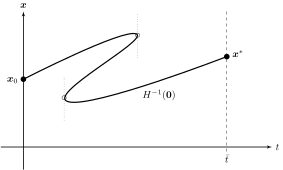
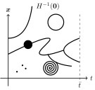
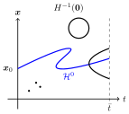

Homotopy continuation
=====================

.. _homotopy_continuation:

Homotopy continuation denotes a class of numerical techniques to solve
high-dimensional nonlinear systems of equations.
The basic idea is the following.
Given a complicated problem to solve,
first take a similar but simple problem and solve it.
Then, gradually transform the simple problem into the complicated problem
while holding on to the solution along the way.
For excellent textbook treatments of homotopy methods see
Zangwill and Garcia (1981) and Allgower and Georg (1990).

Compared to most other numerical methods,
homotopy continuation methods have the major advantage of working globally.
Iterative Newton methods, for example, are only locally convergent,
meaning they require a good initial approximation to produce a solution at all.
In contrast, homotopy methods arrive at solutions without such
a priori knowledge, rendering them an exceptionally powerful tool.

The method generally proceeds in two steps:
First the formulation of a suitable homotopy function,
which implicitly defines a curve from a starting point to the desired solution;
and then the numerical traversal along this curve
until the solution is obtained.
Intuitively, this resembles "bending" the problem until an easy solution
is readily available, then reverting it back to the original form,
while holding on to the solution.

Mathematical formulation
------------------------

More concretely, suppose one wants to find a solution
:math:`\boldsymbol{x}^{*}` to :math:`F(\boldsymbol{x}) = \boldsymbol{0}`,
where :math:`F: \mathbb{R}^n \rightarrow \mathbb{R}^n` is
a vector-valued mapping.
One constructs a function :math:`G: \mathbb{R}^n \rightarrow \mathbb{R}^n`
of the same dimensionality such that a solution
:math:`\boldsymbol{x}_0 \in G^{-1}(\boldsymbol{0})` is known
or trivially obtained.
Then, a homotopy parameter :math:`t \in [0, \bar{t}]`
with :math:`\bar{t} \in (0, \infty]` is introduced.
(The case :math:`\bar{t} = \infty` is explicitly included.)
The homotopy parameter is used to construct a
homotopy function :math:`H(\boldsymbol{x},t)`,
with :math:`H: \mathbb{R}^{n+1} \rightarrow \mathbb{R}^n`,
satisfying :math:`H(\boldsymbol{x},0) = G(\boldsymbol{x})`
and :math:`H(\boldsymbol{x},\bar{t}) = F(\boldsymbol{x})`.
If :math:`H` is constructed properly, it thus offers a
continuous transformation of the original hard problem
:math:`F(\boldsymbol{x}) = \boldsymbol{0}` into a trivial one
:math:`G(\boldsymbol{x}) = \boldsymbol{0}` and vice versa.
The set of solutions :math:`H^{-1}(\boldsymbol{0}) =
\{ (\boldsymbol{x},t) \mid H(\boldsymbol{x},t) = \boldsymbol{0} \}`
then contains a curve connecting the known solution
:math:`(\boldsymbol{x}_0, 0)` to the desired solution
:math:`(\boldsymbol{x}^{*}, \bar{t})`.

Homotopy function and Jacobian matrix
-------------------------------------

The system of equation in question can be written as

.. math:: H(\boldsymbol{x}, t) = \boldsymbol{0}

where :math:`(\boldsymbol{x}, t) \in \mathbb{R}^{n+1}`
and :math:`H: \mathbb{R}^{n+1} \rightarrow \mathbb{R}^n` is a
vector-valued homotopy function.
The corresponding Jacobian matrix
:math:`J: \mathbb{R}^{n+1} \rightarrow \mathbb{R}^n \times \mathbb{R}^{n+1}`
is defined by

.. math:: J(\boldsymbol{x}, t) = \frac{\partial H(\boldsymbol{x}, t)}{\partial (\boldsymbol{x}, t)}

Parameterization
----------------

The homotopy path might have turning points in the sense that the
homotopy parameter :math:`t` is not monotonically increasing along the path,
as illustrated in :numref:`turnings`.

.. _turnings:

    Turning points along the homotopy path.

Therefore, it is generally not possible to follow the path by
naively increasing :math:`t`.
Instead it is convenient to parameterize the homotopy function in terms of
the path length parameter :math:`\tau \in \mathbb{R}_0^+` such that
:math:`H(\boldsymbol{x}(\tau), t(\tau)) = \boldsymbol{0}`. Then,

.. math:: \frac{\partial (\boldsymbol{x}, t)_k}{\partial \tau} \;=\; \eta \: (-1)^k \: \det(J^{(-k)}(\boldsymbol{x}, t))

for :math:`k \in \{1, ..., n\!+\!1\}`,
where :math:`J^{(-k)}(\boldsymbol{x}, t)` denotes the Jacobian matrix
without its :math:`k`-th column and
:math:`\eta \in \mathbb{R}^+` is a normalization factor.
For details, see Zangwill and Garcia (1981, pp. 25 ff.).

Principal branch
----------------

In general, the homotopy path :math:`H^{-1}(\boldsymbol{0})` is not guaranteed
to be as well-behaved as suggested by the previous picture.
It might feature multidimensional segments, bifurcations, dead ends or spirals.
For path tracking to be well-defined,
the homotopy path :math:`H^{-1}(\boldsymbol{0})` must include a
smooth branch :math:`\mathcal{H}^0`
through :math:`(\boldsymbol{x}_0, 0)`
that is almost everywhere one-dimensional,
with only isolated transversals of auxiliary path segments.
A corresponding illustration is provided in :numref:`infeasible`
and :numref:`feasible`.

.. _infeasible:

    Path tracing infeasible.

.. _feasible:

    Path tracing feasible.

All homotopies implemented in sGameSolver are guaranteed to feature a
well-defined principal branch for every possible game.
Tracing this path to arrive at the desired equilibrium
is done numerically by predictor-corrector iterations.
