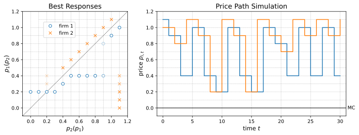

Example: Sequential price competition
=====================================

.. TODO: symmetric equilibria

Consider the famous game of sequential price competition by
`Maskin and Tirole (1988) <https://www.jstor.org/stable/1911701>`_.

There are two firms,
each producing a homogeneous product at zero marginal cost.
The two firms compete on price to maximize the net present value
of profits given a common discount factor.
Time runs in discrete periods and firms take turns to set their prices.
In odd periods, firm 0 sets its price and firm 1's price is locked in,
and vice versa in even periods.
Each period, firms face market demand :math:`d(p) = 2 - p`
which goes to the firm with the lowest price.
In case of equal prices, demand is split evenly.
Finally, firms choose prices from a grid
:math:`P = \{0.0, 0.1, ..., 1.0, 1.1\}`.

The following assumes that the SGameSolver and NumPy packages
have been imported and that the ``game`` has been defined
as in :doc:`/defining_games_example_sequential_moves`,
which also offers further information on the underlying state space.

.. code-block:: python

    import sgamesolver
    import numpy as np

    game = sgamesolver.SGame(...)

The price competition game has a vast multiplicity of equilibria,
some featuring constant equilibrium prices and
some featuring Edgeworth price cycles
(with sequential undercutting and occasional resets).

Before searching the prior space,
we need set the number of searches
and initialize a container to keep track
of the equilibrium strategies found by the solver.

.. code-block:: python

    runs = 100
    strategies = np.zeros(shape=(runs, 24, 2, 11), dtype=np.float64)

Here, ``strategies`` is a 4D array with index
(run, state, player, action).

Random search
-------------

Performing the prior search, including a progress report,
can be done as follows.

.. code-block:: python

    for run in range(runs):
        rho = game.random_strategy(seed=run)
        rho[np.isnan(rho)] = 0  # prior: transform NaN to 0
        homotopy = sgamesolver.homotopy.LogTracing(game, rho=rho)
        homotopy.solver_setup()
        homotopy.solver.verbose = 0  # make silent
        homotopy.solve()
        strategies[run] = homotopy.equilibrium.strategies.round(4)
        print(f"done run {run+1}/{runs}")

This should take around 30 minutes on an ordinary laptop.

We can plot the equilibria with

.. code-block:: python

    run = 0
    plot_eq(strategies[run])

using the function :py:func:`plot_eq` defined as follows.

.. code-block:: python

    import matplotlib.pyplot as plt
    from matplotlib.lines import Line2D
    from matplotlib import gridspec

    def plot_eq(strategy: np.ndarray, T: int = 30) -> plt.figure:

        # simulate price paths
        a_sim = np.zeros((T+1, num_players), dtype=np.int64)   # paths of actions

        # initial prices: firm 1: p_max, firm 2: p_max-p_step, ...
        for i in range(num_players):
            a_sim[0, i] = num_actions - 1 - i

        # simulation
        for t in range(T):
            a_sim[t+1, :] = a_sim[t, :]
            i = t % num_players
            a_not_i = np.delete(a_sim[t, :], i)
            s = get_stateID((i, a_not_i))
            # a_sim[t+1, i] = np.random.choice(range(num_prices), size=1, p=sigma[s, i, :])[0]  # random action
            a_sim[t+1, i] = np.argmax(np.random.multinomial(1, strategy[s, i, :]))  # most likely action
        p_sim = price_grid[a_sim]   # paths of prices

        # plot best responses and simulation of price paths
        fig = plt.figure(figsize=(12, 4))
        gs = gridspec.GridSpec(1, 2, width_ratios=[1, 1.8])

        # 1) best responses
        ax1 = fig.add_subplot(gs[0])
        ax1.set_title('Best Responses', fontsize=14)
        ax1.set_xlabel(r'$p_{2}(p_{1})$', fontsize=12)
        ax1.set_ylabel(r'$p_{1}(p_{2})$', fontsize=12)
        ax1.set_xlim(price_grid.min() - 0.1, price_grid.max() + 0.1)
        ax1.set_ylim(price_grid.min() - 0.1, price_grid.max() + 0.1)

        # grid
        ax1.hlines(price_grid, price_grid - 1, price_grid.max() + 1, colors='black', linestyles='dashed', lw=0.5, alpha=0.3)
        ax1.vlines(price_grid, price_grid - 1, price_grid.max() + 1, colors='black', linestyles='dashed', lw=0.5, alpha=0.3)

        # 45° line
        ax1.plot([price_grid.min() - 1, price_grid.max() + 1], [price_grid.min() - 1, price_grid.max() + 1],
                color='black', linestyle='dotted', lw=1, alpha=1)

        # firm 1
        for a2 in range(num_actions):
            for a1 in range(num_actions):
                ax1.plot(price_grid[a2], price_grid[a1], alpha=strategy[a2, 0, a1], linestyle='None', marker='o',
                        markerfacecolor='white', markeredgecolor='C0', markersize=6)
        # firm 2
        for a1 in range(num_actions):
            for a2 in range(num_actions):
                ax1.plot(price_grid[a2], price_grid[a1], alpha=strategy[num_actions+a1, 1, a2], linestyle='None',
                        marker='x', color='C1', markersize=6)

        ax1.legend(handles=[Line2D([0], [0], linestyle='None', marker='o', markerfacecolor='white', markeredgecolor='C0',
                                markersize=6, label='firm 1'),
                            Line2D([0], [0], linestyle='None', marker='x', color='C1', markersize=6, label='firm 2')],
                loc=(0.2, 0.75))

        # 2) price path simulation
        ax2 = fig.add_subplot(gs[1])
        ax2.set_title('Price Path Simulation', fontsize=14)
        ax2.set_xlabel(r'time $t$', fontsize=12)
        ax2.set_ylabel(r'price $p_{i,t}$', fontsize=12)
        ax2.set_xlim(-1, T+1)
        ax2.set_ylim(price_grid.min() - 0.1, price_grid.max() + 0.1)

        ax2.hlines(price_grid, -1, T+1, colors='black', linestyles='dashed', lw=0.5, alpha=0.3)
        ax2.vlines(range(0, T+1, 5), price_grid.min() - 1, price_grid.max() + 1, colors='black', linestyles='dashed',
                lw=0.5, alpha=0.3)

        ax2.hlines([marginal_costs], -1, T+1, colors='black', linestyles='solid', lw=1, alpha=1)
        ax2.text(T+1, marginal_costs, ' MC', horizontalalignment='left', verticalalignment='center')

        ax2.step(range(T+1), p_sim, where='post')

        plt.show()

        return fig

The resulting plot should be as in :numref:`maskin-tirole-simulation`.

.. _maskin-tirole-simulation:

    Equilibrium in the sequential price competition game.

It shows best responses of both players as well as
a simulation of the resulting price path.
The price path simulation illustrates the famous Edgeworth price cycle pattern
of sequential undercutting and occasional large price increases.
