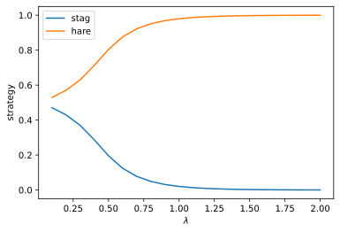

Computing QRE for multiple lambdas
==================================

When it comes to the QRE homotopy,
one might not only be interested in the limiting stationary equilibrium,
but also in quantal response equilibria
for intermediate values of :math:`\lambda`.
Therefore, sGameSolver can perform path following not only until convergence,
but also to specific target values of the homotopy parameter.

Example: Stag hunt
------------------

Consider the following version of the stag hunt game.

+---------+------+--------+------+
|                | player1       |
+                +--------+------+
|                |  stag  | hare |
+---------+------+--------+------+
| player0 | stag | 10, 10 | 1, 8 |
+         +------+--------+------+
|         | hare |  8,  1 | 5, 5 |
+---------+------+--------+------+

We implement the game and prepare the solver as follows.

.. tabs::

    .. group-tab:: Table

        ======  =========  =========  =========  =========  ==========
        state   a_player0  a_player1  u_player0  u_player1  phi_state0
        ======  =========  =========  =========  =========  ==========
        delta                         0          0
        state0  stag       stag       10         10         0
        state0  stag       hare       1          8          0
        state0  hare       stag       8          1          0
        state0  hare       hare       5          5          0
        ======  =========  =========  =========  =========  ==========

        .. code-block:: python

            import sgamesolver

            game = sgamesolver.SGame.from_table('path/to/table.xlsx')

            homotopy = sgamesolver.homotopy.QRE(game)
            homotopy.solver_setup()
            homotopy.solver.verbose = 0  # make silent

    .. group-tab:: Arrays

        .. code-block:: python

            import sgamesolver
            import numpy as np

            payoff_matrix = np.array([[[10, 1],
                                    [8, 5]],
                                    [[10, 8],
                                    [1, 5]]])
            game = sgamesolver.SGame.one_shot_game(payoff_matrix=payoff_matrix)
            game.action_labels = ['stag', 'hare']

            homotopy = sgamesolver.homotopy.QRE(game)
            homotopy.solver_setup()
            homotopy.solver.verbose = 0  # make silent

Let's define the values of :math:`\lambda` that we are interested in and
set up an empty container for the corresponding quantal response equilibria.
Since the game and thus all quantal response equilibria are symmetric,
we only need to keep track of the strategies of player 0.

.. code-block:: python

    lambdas = np.arange(0.1, 2.1, 0.1)
    strategies = np.zeros(shape=(len(lambdas), 2), dtype=np.float64)

Now we can iterate over all values of :math:`\lambda`,
let sGameSolver compute the corresponding quantal response equilibria
and save them in our strategies container.

.. code-block:: python

    for idx, lambda_ in enumerate(lambdas):
        homotopy.solver.t_target = lambda_
        homotopy.solve()
        strategies[idx] = homotopy.equilibrium.strategies[0, 0]  # state_0, player_0

Finally, we can use the quantal response equilibria
for further analysis or for plotting.

.. code-block:: python

    import matplotlib.pyplot as plt
    plt.plot(lambdas, strategies[:, 0], label='stag')
    plt.plot(lambdas, strategies[:, 1], label='hare')
    plt.xlabel(r'$\lambda$')
    plt.ylabel('strategy')
    plt.legend()
    plt.show()

The resulting picture is shown in :numref:`qre_for_multiple_lambdas`.

.. _qre_for_multiple_lambdas:

    Quantal response equilibria (all symmetric) in the stag hunt game
    for different values of the precision parameter :math:`\lambda`.
