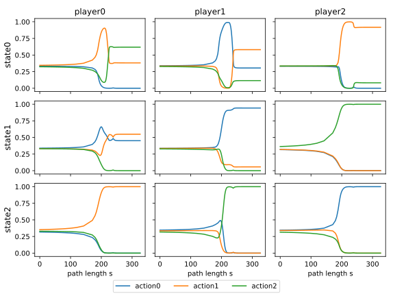

Solving games
=============

Suppose we have already defined a stochastic game
and a ``homotopy`` of based on it
(see section :doc:`choosing_homotopy`),
along the following lines:

.. code-block:: python

    import sgamesolver
    game = sgamesolver.SGame.random_game(3, 3, 3, seed=123)
    homotopy = sgamesolver.homotopy.LogTracing(game)

Then, solving the stochastic game requires two steps:

1. Setting up the solver and finding a starting point.
2. Starting the solver and letting it run until convergence is achived.

In code:

.. code-block:: python

    homotopy.solver_setup()
    homotopy.solve()

Ideally, the solver should converge without any further steps.
If you happen to encounter a game that cannot be solved out of the box,
see the section :doc:`troubleshooting` for suggestions on how to proceed.

Verbosity
---------

By default, the solver displays a little progress report such as

.. code-block:: console

    ==================================================
    Start homotopy continuation
    Step   140: t =  1.000 ↑, s =  328.1, ds =  1.840120
    Step   140: Continuation successful. Total time elapsed: 0:00:01
    End homotopy continuation
    ==================================================
    An equilibrium was found via homotopy continuation.

which corresponds to verbosity level 1.

The solver can be silenced by changing the verbosity level to 0.
Likewise, the solver displays more detailed output for verbosity levels 2 and 3.

.. code-block:: python

    homotopy.solver_setup()
    homotopy.solver.verbose = 0
    homotopy.solve()

Path plot
---------

The solver can be asked to keep track of the path that it traverses.
The path can then be plotted, illustrating the evolution of strategies.

.. code-block:: python

    homotopy.solver_setup()
    homotopy.solver.start_storing_path()
    homotopy.solve()
    homotopy.plot_path()

The resulting :numref:`path_s` shows the evolution of strategies
in path length :math:`s` across states and players.

.. _path_s:

    Homotopy path under logarithmic tracing homotopy:
    Strategies depending on path length :math:`s`.

One can clearly see that strategies start close to the centroid,
i.e. close to uniform mixing across all available actions,
and converge along the path.

For more information on how to use the solver,
see section :doc:`interacting_with_the_solver`.
