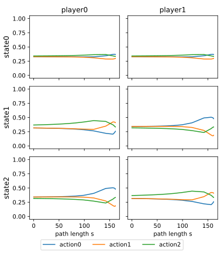
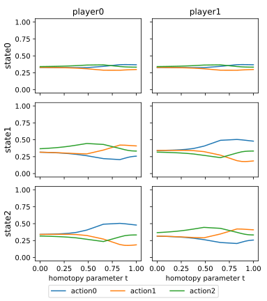

Example: Simple path following
==============================

Let's take a look at the
:doc:`dynamic version of Rock Paper Scissors <defining_games_example_simple_stochastic_game>`
again.
Suppose we have already defined the corresponding stochastic game
and a ``homotopy`` based on it (see section :doc:`choosing_homotopy`).
Then path following is done in two steps:

1. Setting up the solver and finding the starting point.
2. Perform homotopy continuation from the starting point until convergence.

In code:

.. code-block:: python

    homotopy.solver_setup()
    homotopy.solve()

Verbosity
---------

By default, the solver displays a little progress report such as

.. code-block:: console

    ==================================================
    Start homotopy continuation
    Step    58: t =  1.000 ↑, s =  161.4, ds = 0.0003944
    Step    58: Continuation successful. Total time elapsed: 0:00:00
    End homotopy continuation
    ==================================================
    An equilibrium was found via homotopy continuation.

which corresponds to verbosity level 1.

The solver can be silenced by changing the verbosity level to 0.
Likewise, the solver displays more detailed output for verbosity levels 2 and 3.

.. code-block:: python

    homotopy.solver_setup()
    homotopy.solver.verbose = 0
    homotopy.solve()

Path plot
---------

The solver can be asked to keep track of the path that it traverses.
The path can then be plotted, illustrating the evolution of strategies.

.. code-block:: python

    homotopy.solver_setup()
    homotopy.solver.start_storing_path()
    homotopy.solve()
    homotopy.plot_path()

The resulting :numref:`path_s` shows the evolution of strategies
in path length :math:`s` across states and players.

.. _path_s:

    Homotopy path of dynamic Rock Paper Scissors under logarithmic tracing homotopy:
    Strategies depending on path length :math:`s`.

One can clearly see that strategies start close to the centroid,
i.e. close to uniform mixing across rock, paper, and scissors
with probability around :math:`\frac{1}{3}` for each. 

Alternatively, the path can be parameterized in the homotopy parameter :math:`t`.

.. code-block:: python

    homotopy.solver_setup()
    homotopy.solver.start_storing_path()
    homotopy.solve()
    homotopy.plot_path(x_axis='t')

The resulting :numref:`path_t` shows the evolution of strategies
in homotopy parameter :math:`t` across states and players.

.. _path_t:

    Homotopy path of dynamic Rock Paper Scissors under logarithmic tracing homotopy:
    Strategies depending on homotopy parameter :math:`t`.
