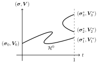

Starting the solver at some equilibrium
=======================================

Stochastic games often feature a vast multiplicity of stationary equilibria.
For almost all games, the number of equilibria is odd.
Typically, in terms of homotopy paths,
one equilibrium is connected to the unique starting point
while the remaining equilibria (an even number of them)
are pairwise connected by auxiliary paths.
This typical situation is depicted in :numref:`connected_equilibria`.

.. _connected_equilibria:

    Three equilibria: Equilibrium 1 is connected to the starting point,
    and equilibria 2 and 3 are connected to each other.

By default, sGameSolver traces out the equilibrium
connected to the starting point.
If some other equilibrium is known, however,
the solver can also start at this equilibrium
and follow the auxiliary path to the connected equilibrium.

Example: Stag hunt
------------------

Consider the following version of the stag hunt game.

+---------+------+--------+------+
|                | player1       |
+                +--------+------+
|                |  stag  | hare |
+---------+------+--------+------+
| player0 | stag | 10, 10 | 1, 8 |
+         +------+--------+------+
|         | hare |  8,  1 | 5, 5 |
+---------+------+--------+------+

The game can be implemented as follows.

.. tabs::

    .. group-tab:: Arrays

        .. code-block:: python

            import sgamesolver
            import numpy as np

            payoff_matrix = np.array([[[10, 1],
                                    [8, 5]],
                                    [[10, 8],
                                    [1, 5]]])
            game = sgamesolver.SGame.one_shot_game(payoff_matrix=payoff_matrix)
            game.action_labels = ['stag', 'hare']

    .. group-tab:: Table

        ======  =========  =========  =========  =========  ==========
        state   a_player0  a_player1  u_player0  u_player1  phi_state0
        ======  =========  =========  =========  =========  ==========
        delta                         0          0
        state0  stag       stag       10         10         0
        state0  stag       hare       1          8          0
        state0  hare       stag       8          1          0
        state0  hare       hare       5          5          0
        ======  =========  =========  =========  =========  ==========

        .. code-block:: python

            import sgamesolver
            game = sgamesolver.SGame.from_table('path/to/table.xlsx')

This game has three equilibria, all symmetric:

1. the payoff-dominant equilibrium (stag, stag),
2. the risk-dominant equilibrium (hare, hare),
3. and a mixed equilibrium
   :math:`\bigl((\frac{2}{3},\frac{1}{3}),(\frac{2}{3},\frac{1}{3})\bigr)`
   in which both players play stag with probability :math:`\frac{2}{3}`
   and hare with probability :math:`\frac{1}{3}`.

The mixed equilibrium is unstable:
It can be reached by homotopy continuation only if
the prior exactly matches the mixed equilibrium.
Any prior different from the mixed equilibrium
will induce a homotopy path leading to one of the two pure equilibria.
The two pure equilibria are stable.
Our goal is to find the mixed equilibrium without guessing it,
i.e. by tracing a homotopy path from one of the two pure equilibria
to the mixed equilibrium.

First, let's "find" the two pure equilibria
by starting from pure symmetric priors.
Starting from the stag prior ...

.. code-block:: python

    stag_prior = np.array([[[1, 0],
                            [1, 0]]])
    homotopy_stag = sgamesolver.homotopy.LogTracing(game, rho=stag_prior)
    homotopy_stag.solver_setup()
    homotopy_stag.solve()

... we get the stag equilibrium

>>> print(homotopy_stag.equilibrium)
+++++++++ state0 +++++++++
                      stag  hare
player0 : v=10.00, σ=[1.000 0.000]
player1 : v=10.00, σ=[1.000 0.000]

and starting from the hare prior ...

.. code-block:: python

    hare_prior = np.array([[[0, 1],
                            [0, 1]]])
    homotopy_hare = sgamesolver.homotopy.LogTracing(game, rho=hare_prior)
    homotopy_hare.solver_setup()
    homotopy_hare.solve()

... we get the hare equilibrium

>>> print(homotopy_hare.equilibrium)
+++++++++ state0 +++++++++
                     stag  hare
player0 : v=5.00, σ=[0.000 1.000]
player1 : v=5.00, σ=[0.000 1.000]

Now, we can find the mixed equilibrium as follows.
We can use the homotopy path induced by the stag prior
(for which the starting point is connected to the stag equilibrium),
but start at the hare equilibrium
(which should be connected to the mixed equilibrium).

.. code-block:: python

    homotopy_mixed = sgamesolver.homotopy.LogTracing(game, rho=stag_prior)  # stag prior
    homotopy_mixed.solver_setup()
    homotopy_mixed.solver.y = homotopy_hare.solver.y.copy()                 # hare equilibrium
    homotopy_mixed.solver.sign *= -1                                        # going "backwards"

If we start just now, however,
the solver will (rightfully) think it is already at a solution.
Therefore, we tell it to walk away from t=1 a bit.

.. code-block:: python

    homotopy_mixed.solver.t_target = 0.99
    homotopy_mixed.solve()

After having found a solution at t=0.99,
we can now set the target to t=1 again and keep going.

.. code-block:: python

    homotopy_mixed.solver.t_target = 1
    homotopy_mixed.solve()

This results in the final mixed equilibrium.

>>> print(homotopy_mixed.equilibrium)
+++++++++ state0 +++++++++
                     stag  hare 
player0 : v=7.00, σ=[0.667 0.333]
player1 : v=7.00, σ=[0.667 0.333]
